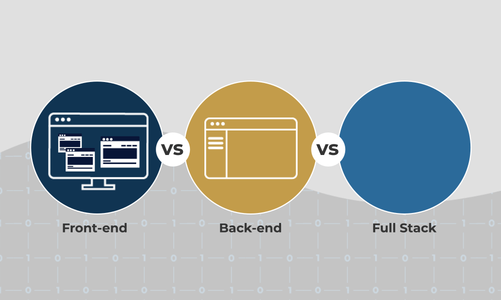

<h2 align="center">📋&ensp; <i>Ｓｏｂｒｅ</i> &ensp;📋</h2>

  

  <ul align="left" style="padding-right: 340px;">
    <li>☕ Technology, Coffee and Code. ☕</li> 
    <li>🚀 Software Engineer 🚀</li> 
    <li>💻 Front-end - Back-end - Desktop - Web - IA - Cyber 💻</li> 
    <li><i>🧠 "Apaixonado por transformar ideias em código funcional e escalável." 🧠</i></li> 
  </ul>
      

<h2 align="center">💼&ensp; <i>Ｐｒｏｊｅｔｏｓ</i> &ensp;💼</h2>

  
  
  <table height="365px" width="368px">
    <tr>
      <td>
      
      </td>
    </tr>
    <tr>
      <td>
      
      </td>
    </tr>
        <tr>
      <td>
      
      </td>
    </tr>
    <tr>
      <td>
      
      </td>
    </tr>
    <tr>
      <td>
      
      </td>
    </tr>
    <tr>
      <td>
      
      </td>
    </tr>
    <tr>
      <td>
      
      </td>
    </tr>
    <tr>
      <td>
      
      </td>
    </tr>
    <tr>
      <td>
      
      </td>
    </tr>
    <tr>
      <td>
      
      </td>
    </tr>
    <tr>
      <td>
      
      </td>
    </tr>
    <tr>
      <td>
      
      </td>
    </tr>
    <tr>
      <td>
      
      </td>
    </tr>
    <tr>
      <td>
      
      </td>
    </tr>
    <tr>
      <td>
      
      </td>
    </tr>
    <tr>
      <td>
      
      </td>
    </tr>
    <tr>
      <td>
      
      </td>
    </tr>
    <tr>
      <td>
      
      </td>
    </tr>
    <tr>
      <td>
      
      </td>
    </tr>
    <tr>
      <td>
      
      </td>
    </tr>
    <tr>
      <td>
      
      </td>
    </tr>
    <tr>
      <td>
      
      </td>
    </tr>
    <tr>
      <td>
      
      </td>
    </tr>
    <tr>
      <td>
      
      </td>
    </tr>
    <tr>
      <td>
      
      </td>
    </tr>
    <tr>
      <td>
      
      </td>
    </tr>
    <tr>
      <td>
      
      </td>
    </tr>
    <tr>
      <td>
      
      </td>
    </tr>
  </table>

  

<h2 align="center">🛠️&ensp; <i>Ｔｅｃｎｏｌｏｇｉａ s</i> &ensp;🛠️</h2>

<table align="right" height="300px" width="175px" style="width: 320px; padding: 10px 0px 10px 10px;">
  <tr>
    <td align="center">
       
      
        <b>
          <pre>Java</pre>
        </b>
      
    </td>
    <td align="center">
       
      
        <b>
          <pre>Javascriptr</pre>
        </b>
      
    </td>
    <td align="center">
       
      
        <b>
          <pre>Node</pre>
        </b>
      
    </td>
    <td align="center">
       
      
        <b>
          <pre>Eclipse</pre>
        </b>
      
    </td>
    <td align="center">
       
      
        <b>
          <pre>Intellij</pre>
        </b>
      
    </td>
  </tr>
  <tr>
    <td align="center" width="100px;">
       
      
        <b>
          <pre>Wordspress</pre>
        </b>
      
    </td>
    <td align="center">
       
      
        <b>
          <pre>CSS3</pre>
        </b>
      
    </td>
    <td align="center">
       
      
        <b>
          <pre>HTML5</pre>
        </b>
      
    </td>
    <td align="center">
       
      
        <b>
          <pre>MYSQL</pre>
        </b>
      
    </td>
    <td align="center">
       
      
        <b>
          <pre>Postgres</pre>
        </b>
      
    </td>
  </tr>
  <tr>
    <td align="center">
       
      
        <b>
          <pre>React</pre>
        </b>
      
    </td>
    <td align="center">
       
      
        <b>
          <pre>Bootstrap</pre>
        </b>
      
    </td>
    <td align="center" width="100px;">
       
      
        <b>
          <pre>SpringBoot</pre>
        </b>
      
    </td>
    <td align="center">
       
      
        <b>
          <pre>Electron</pre>
        </b>
      
    </td>
    <td align="center">
       
      
        <b>
          <pre>AWS</pre>
        </b>
      
    </td>
  </tr>
  <tr>
    <td align="center">
       
      
        <b>
          <pre>Styled Ubuntu</pre>
        </b>
      
    </td>
    <td align="center">
       
      
        <b>
          <pre>VScode</pre>
        </b>
      
    </td>
    <td align="center">
       
      
        <b>
          <pre>Github</pre>
        </b>
      
    </td>
    <td align="center">
       
      
        <b>
          <pre>Git</pre>
        </b>
      
    </td>
    <td align="center" width="100px;">
       
      
        <b>
          <pre>Windows</pre>
        </b>
      
    </td>
  </tr>
</table> 
               

<h2 align="center">📱&ensp; <i>Ｃｏｎｔａｔｏ</i> &ensp;📱</h2>

  

  <!--<a href="https://portfolio-guga-silva.vercel.app/cv/Curriculo-WebDeveloper-Gustavo-Silva.zip" alt="">-->
    
  </a>
   
  <!--<a href="https://portfolio-guga-silva.vercel.app/" alt="" target="_blank">-->
    
  </a> 
  
  
  
  

   

<h2 align="center">

  
📈&ensp; <i>Ａｔｉｖｉｄａｄｅ</i> &ensp;📈

   
  
  

  
  
    

  
    

 

